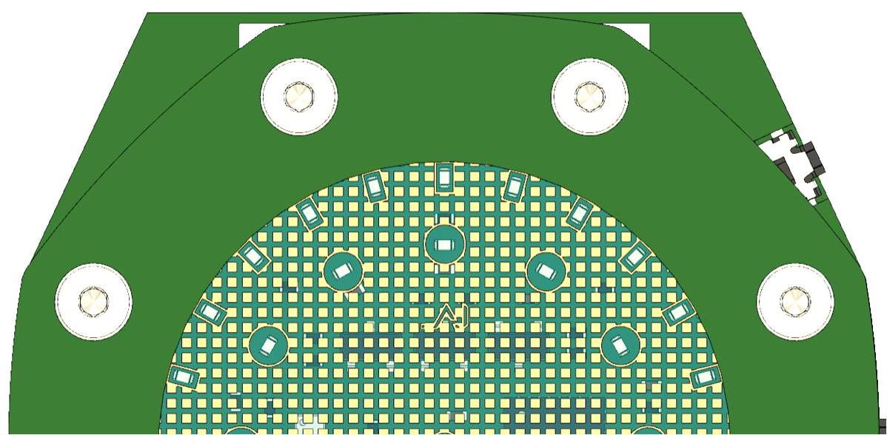

# ⌚️ Project OAK (Open Art Work)

> *An approach to mimic analogue watch complications in a digital timepiece. One LED at a time.*

> ⚠️ **_Current Version: v0.1_**

> 📝 [_Version History_](Design/LLD_Design/README.md)
---

## 📁 Repository Overview

This repository contains all files related to **Project OAK**, including:

- Design files
- Datasheets
- Pin configuration sheet
- BOM (Bill of Materials)
- Source code and libraries
- Mechanical Integration files

📎 **Project OAK SCH and DSN files can be viewed on [CADLAB.io](https://cadlab.io/project/28412)**

---

## 📖 Project Overview

**Project_OAK** explores a different approach to designing digital timepieces that mimic the beauty and intricacy of **[mechanical watch complications](https://teddybaldassarre.com/blogs/watches/watch-complications?srsltid=AfmBOoqZpyDy6AT5w2ClBAenimUXbEy8DH4jYCP8Jfb1IKT3pajwjdwo)**.

While building a digitalised analogue-style watch is fairly common, recreating some of the mechanical features in a purely digital watch is both challenging and exciting.

> Although current smartwatches offer these functions via complex hardware, my goal is to **implement them using simple hardware** with minimal processing power.

- To add to its uniqueness, the **entire watch will be constructed using stacked PCBs**, which is aimed to be modular and reconfigurable based on our needs.
- The watch is designed with multiple colours and solder finishes, giving it a true electronics-nerd feel.

---

## 🔧 Initial Prototype

📌 **[Project_OAK_MAIN_BRD_V0.1 / V0.2](Design/LLD_Design/V0.1/Project_OAK_MAIN_BRD_V0.1_RTC_Change/Project_OAK_MAIN_BRD_V0.1.pdf) is an "engineering sample".**

The primary goal of these variants is to **test all available interfaces, validate battery performance, identify design flaws, and iterate for improvements**.

Consider this board a creative playground, push its limits and explore unique feature additions for the upcoming revision.

---

## 🎲 Down the line

Though the **initial version** of Project_OAK (V0.1 / V0.2) is just a simple watch featuring a **time display** using dual-tone LEDs,

> The Future versions shall include:
> - GMT
> - Minute Repeater (ambitious!)
> - Interactive sensors (Light, IMU, Temp, Step tracking, Buzzer, etc.)
> - Higher-density LED matrix for complex visuals.
> - Position tracking using GPS, LoRa, etc. (ambitious!)
> - Exploring Low-power MCUs for long-life operation.
> - Rechargeable battery option.
> - Solar panel integration for energy harvesting.
> - ...

---

## 💎 Mechanical Integration (v0.1)

> *(These are the outputs from V0.1 variant. Design changes are expected in V0.2)*

---

## ⚙️ Getting Started

### 🔌 Programming the Board

The board can be programmed using the **Arduino IDE** via the ISP function. All the source code can be found in [ProjectOAK/codes](Codes) folder. 

#### 📝 Requirements:
- Arduino UNO/MINI/NANO/MEGA as ISP programmer
- ICSP connection to the Main Board (test points on the bottom side)

#### 💡 ICSP Programming Notes:
- ICSP pins are exposed via **Test Points** arranged in 2.4mm pitch 2x3 connector style
- Either mount **male headers** or directly solder wires for programming
- Board supports **two power options**:
  - `3V Coin Cell (default)`
  - `EXT_3V3_IN` via ICSP (requires mounting resistor R1, which is **DNI by default**)

### ⚡ Arduino IDE Settings

> - Refer to this GitHub repo on how to burn the Bootloader and how to flash code through Arduino IDE [MiniCore](https://github.com/MCUdude/MiniCore)
> - When programming the MAIN_BRD, update the ARDUINO IDE settings as shown below.

#### ❤️‍🔥 Let me know what you think of this project. I'd love to hear your thoughts!

### ✨ Happy Designing!

---
