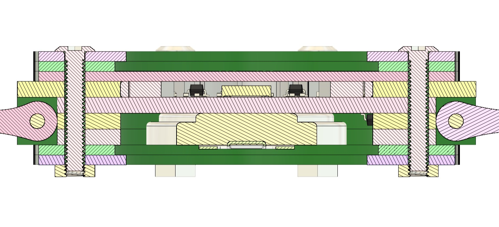

# ⌚️ Project OAK (Open Art Work)

> *An approach to mimic analogue watch complications in a digital timepiece, one LED at a time.*

---

## 📁 Repository Overview

This repository contains all files related to **Project_OAK**, including:
- Design (DSN) files
- Datasheets
- Pin configuration sheet
- BOM (Bill of Materials)
- Source code and libraries

📎 **Project OAK SCH and DSN files can be viewed on [CADLAB.io](https://cadlab.io/project/28412)**

---

## 📖 Project Overview

**Project_OAK** explores a different approach to designing digital timepieces that mimic the beauty and intricacy of **mechanical watch complications**.

While building a digitalised analogue-style watch is fairly common, recreating some of the mechanical features in a purely digital watch is both challenging and exciting.

### ⛓ Key Mechanical Complications Reimagined:
- **Minute Repeater**: Indicates time using chimes.
- **GMT**: Tracks a second time zone in addition to the local time.
- **And more** ...

> Although smartwatches offer these functions via software, my goal is to **implement them locally using hardware logic** with minimal processing power.

To add to its uniqueness, the **entire watch will be made using stacked PCBs**, designed with multiple colours and selective finishes, giving it a true electronics-nerd feel.

---

## ⏳ Current Status

The **initial version** of Project_OAK (V0.1 / V0.2) will be a simple digital watch featuring a **time display** using dual-tone LEDs.

> Future versions may include:
> - GMT & Minute Repeater functionality
> - Interactive sensors (Light, IMU, Temp, Step tracking, Buzzer, etc.)
> - Position tracking using GPS, LoRa, etc. (ambitious goal)
> - Low-power MCUs for long-life operation.

This initial version is basically powered by a **3V coin cell**, with future variants possibly integrating a rechargeable battery (maybe also a solar panel?).

---

## 💎 Initial Mockup

> *(These are the outputs from V0.1 variant. Design changes are expected in V0.2)*

---

## 🔧 Prototyping

📌 **[Project_OAK_MAIN_BRD_V0.1](Design/LLD_Design/V0.1/Project_OAK_MAIN_BRD_V0.1_RTC_Change/Project_OAK_MAIN_BRD_V0.1.pdf) is an engineering sample. The design is not mature enough for mass production.**

The primary goal of this variant is to **test all available interfaces, validate MCU performance, identify design flaws, and iterate for improvements**.

Consider this board a creative playground, push its limits. Explore unique feature additions for the upcoming revision.

---

## ⚙️ Getting Started

The main board, `Project_OAK_MAIN_BRD_V0.1`, includes the following:

### 🔩 Key Components
- **Microcontroller (MCU)**: [ATMega328PB](Datasheet/ATMEGA328PB.pdf)
- **Real-Time Clock (RTC)**: [RV-8263-C7](Datasheet/RV-8263-C7.pdf)
- **LEDs**: 36 total (12 for hour, 24 for minute)
- **Buttons**: 3 tactile switches
- **Power Monitor**: 3V supply sensing

---

### 🔌 Programming the Board

The board can be programmed using the **Arduino IDE** via the ISP function. 

#### 📝 Requirements:
- Arduino UNO/MINI/NANO/MEGA as ISP programmer
- ICSP connection to the Main Board (test points on the bottom side)

#### 💡 ICSP Programming Notes:
- ICSP pins are exposed via **Test Points** arranged in 2.4mm pitch 2x3 connector style
- Either mount **male headers** or directly solder wires for programming
- Board supports **2 power options**:
  - `3V Coin Cell (default)`
  - `EXT_3V3_IN` via ICSP (requires mounting resistor R1, which is **DNI by default**)

---

### ⚡ Arduino IDE Settings

> - Refer to this GitHub repo on how to burn Bootloader and how to flash code through Arduino IDE [MiniCore](https://github.com/MCUdude/MiniCore)
> - When programming the MAIN_BRD, update the ARDUINO IDE settings as shown below.

#### ❤️‍🔥 Let me know what you think of this project, I'd love to hear your thoughts!

### ✨ Happy Designing!

---
